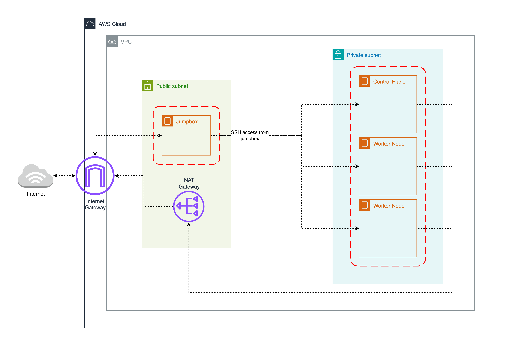

# Kubernetes The Hard Way - AWS Infrastructure

AWS infrastructure setup made for playing with [kubernetes-hard-way](https://github.com/kelseyhightower/kubernetes-the-hard-way) by Kelsey Hightower.

Creates a secure environment with Control Plane, Worker Nodes, and a Bastion Host/Jumpbox for connecting to the Cluster.

## Default Architecture
<p align="center">
  
</p>

**Default Network Flow:**
```
Internet -> IGW -> Jumpbox (Public Subnet)
                    |
                    | SSH
                    v 
            Control Plane + Workers (Private Subnet)
                    |
                    | Outbound
                    v
                 NAT Gateway -> Internet
```

### NAT Gateway Toggle
NAT Gateway is relatively expensive. With that said - to save some money - you can disable NAT Gateway without affecting the overall functionality.

```hcl
# terraform.tfvars
create_nat = false
```

**Without NAT:**
- Private instances receive **public IPs**
- The traffic from the 'private' subnet **routed through Internet Gateway** instead of NAT
- Security relies **only on security groups** enabling access to Cluster Nodes only from the Jumpbox


To mimic **production-like setup** keep `create_nat = true` for proper security.

## 🚀 Quick Start

### Prerequisites
- AWS CLI configured
- Terraform v1.5+
- SSH client

### Option 1: Default Quick Deployment (recommended)

```bash
# Make the setup script executable and run the script
chmod +x setup.sh
./setup.sh
```

The script will:
1. Generate SSH keys
2. Get your public IP to whitelist jumpbox access
3. Create `terraform.tfvars`

After that, you can optionally further modify the configuration in `terraform.tfvars` (e.g. toggle off NAT or change the number of Worker Nodes by modifying `worker_count`) or just run terraform commands to deploy the default configuration.

```
terraform init
terraform apply
```

### Option 2: Manual Setup

```bash
# 1. Generate SSH keys
mkdir ssh # preferably in the project root dir
ssh-keygen -t rsa -b 4096 -f ssh/id_rsa -N ""

# 2. Copy example config and customize
cp terraform.tfvars.example terraform.tfvars
# Edit terraform.tfvars with the desired config

# 3. Deploy
terraform init
terraform apply
```

## ⚡️ Connect to the Cluster

```bash
# Add SSH key to SSH agent
eval "$(ssh-agent -s)"
ssh-add ssh/id_rsa

# Connect to jumpbox
ssh -A -o StrictHostKeyChecking=no admin@$(terraform output -raw jumpbox_public_ip)

# From jumpbox access the cluster instances (use the IPs from terraform output)
terraform output

# Control Plane (edit with control_plane_private_ip from terraform output)
ssh -o StrictHostKeyChecking=no admin@<control_plane_private_ip>

# Worker 1 (edit with the first ip from worker_private_ips from terraform output)
ssh -o StrictHostKeyChecking=no admin@<worker_1_private_ip>

# Worker 2 (edit with the second ip from worker_private_ips from terraform output)
ssh -o StrictHostKeyChecking=no admin@<worker_2_private_ip>
```

## 📦 What Gets Created
By default the setup creates:
| Resource | Type | Purpose |
|----------|------|---------|
| **Jumpbox** | t4g.nano | Bastion host for secure access |
| **Control Plane** | t4g.small | Kubernetes master node |
| **Workers** | 2x t4g.small | Kubernetes worker nodes |
| **VPC** | 10.0.0.0/16 | Isolated network |
| **Public Subnet** | 10.0.1.0/24 | Jumpbox + NAT Gateway |
| **Private Subnet** | 10.0.2.0/24 | K8s nodes (no public IPs) |
| **NAT Gateway** | - | Outbound internet for private subnet |
| **Security Groups** | - | Firewall rules (least privilege) |

## 🔒 Security Features

- By default private instances have **no public IPs**. 
- Outbound-only internet access through **NAT Gateway**.
- Security Groups enabling SSH access to Cluster Nodes **only through Jumpbox** instance.
- Jumpbox restricted to **your IP only**.
- SSH with agent forwarding, so keys never leave your machine.

## 🧹 Cleanup
To deprovision the infrastructure run:
```bash
terraform destroy
```
If u wish to start from scratch after the cleanup, simply remove the `ssh` directory, `terraform.tfvars` file and proceed with one of the options from Quick Start section.

---
Happy learning!
